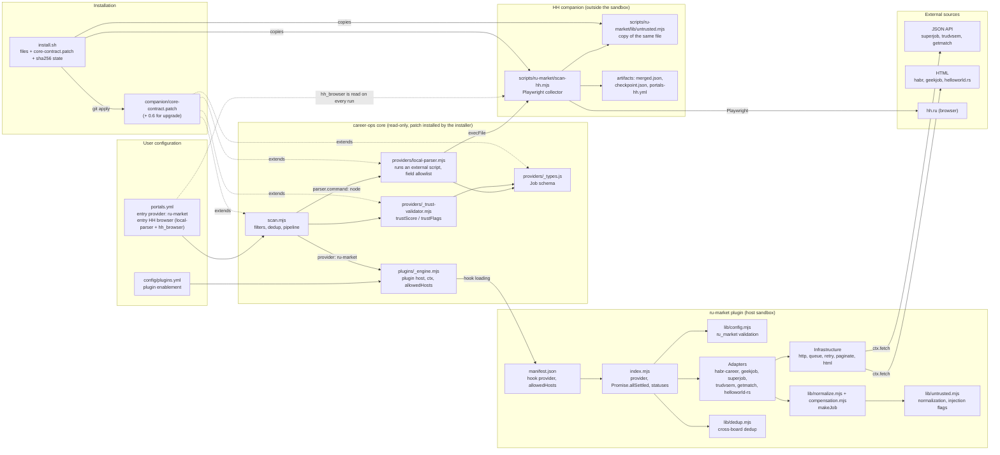

# Architecture: components and relations

Status: Implemented
Date: 2026-10-10
Type: architecture

State as of version 0.7.0. The data flow is described separately: [data-flow.md](data-flow.md). Decisions and their rationale: [../roadmap/provider-architecture-review.md](../roadmap/provider-architecture-review.md). Provider comparison: [../providers/README.md](../providers/README.md).

The plugin consists of two independent parts. The `ru-market` provider runs inside the core plugin host and reaches only allowed hosts through `ctx.fetch*`. The HH companion runs outside the host, because it launches a browser, and connects to core through `local-parser`. Shared code (`untrusted.mjs`) is installed into both parts from one file.

## Components and dependencies

## Boundaries and rules

| Boundary | Rule |
|---|---|
| Plugin and network | HTTPS only, to hosts from `allowedHosts`; requests go through `ctx.fetch*` (SSRF protection, 10 s by default). The plugin does not import Playwright and does not spawn processes. |
| Companion and core | The companion runs as an external parser: `local-parser` calls `node scripts/ru-market/scan-hh.mjs ...` and reads JSON from stdout. The companion configuration lives in `portals.yml` (the `hh_browser` block) and is re-read on every run. |
| Core patch | `core-contract.patch` extends `local-parser` (fields `employment`, `professional_role`, `injectionFlags`, `compensation`, `sourceStatuses`), `_trust-validator` (flag `prompt-injection-suspected`), `_types.js` and `scan.mjs`. Installed by `install.sh`; a core update may require reinstalling it. |
| Shared code | `lib/untrusted.mjs` has one source copy. `install.sh` puts it into `scripts/ru-market/lib/` and records its sha256 in `scan-hh.install.json`; the installer does not overwrite locally modified files. |
| Source separation | `hh` in `ru_market.primary_source_order` is rejected with a migration error. The source order allows lengths 2, 4, 5 and 6. |

## Extension: a new provider

- Through an API or HTML without a browser: a new adapter in `lib/`, registration in `index.mjs`, the host in `manifest.json`. The result must go through `makeJob`, then `untrusted.mjs` is applied automatically.
- Through a browser: a script in `scripts/ru-market/`, importing `./lib/untrusted.mjs`, a separate `local-parser` entry in `portals.yml` with its own configuration block modelled on `hh_browser`.
