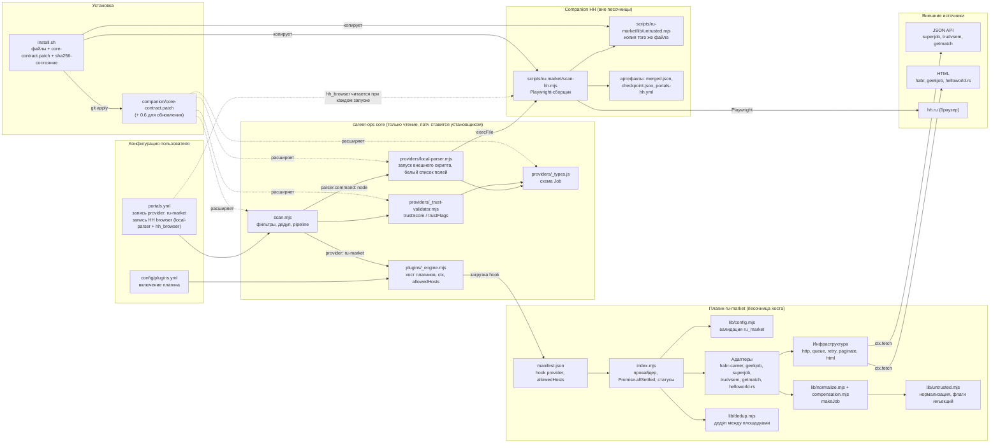

# Архитектура: компоненты и связи

Состояние на версию 0.7.0. Поток данных описан отдельно: [data-flow.md](data-flow.md). Решения и их обоснование: [../roadmap/provider-architecture-review.md](../roadmap/provider-architecture-review.md).

Плагин состоит из двух независимых частей. Провайдер `ru-market` работает внутри хоста плагинов core и ходит только на разрешённые хосты через `ctx.fetch*`. Companion для HH работает вне хоста, потому что запускает браузер, и подключается к core через `local-parser`. Общий код (`untrusted.mjs`) ставится в обе части из одного файла.

## Компоненты и зависимости

## Границы и правила

| Граница | Правило |
|---|---|
| Плагин и сеть | Только HTTPS на хосты из `allowedHosts`, запросы идут через `ctx.fetch*` (SSRF-защита, 10 с по умолчанию). Плагин не импортирует Playwright и не запускает процессы. |
| Companion и core | Companion запускается как внешний парсер: `local-parser` вызывает `node scripts/ru-market/scan-hh.mjs ...` и читает JSON из stdout. Конфиг companion живёт в `portals.yml` (блок `hh_browser`) и перечитывается при каждом запуске. |
| Патч core | `core-contract.patch` расширяет `local-parser` (поля `employment`, `professional_role`, `injectionFlags`, `compensation`, `sourceStatuses`), `_trust-validator` (флаг `prompt-injection-suspected`), `_types.js`, `scan.mjs`. Ставится `install.sh`, при обновлении core может потребоваться переустановка. |
| Общий код | `lib/untrusted.mjs` одна исходная копия. `install.sh` кладёт её в `scripts/ru-market/lib/` и записывает sha256 в `scan-hh.install.json`, локально изменённые файлы установщик не перезаписывает. |
| Разделение источников | `hh` в `ru_market.primary_source_order` отвергается ошибкой миграции. Порядок источников допускает длины 2, 4, 5 и 6. |

## Расширение: новый провайдер

- Через API или HTML без браузера: новый адаптер в `lib/`, регистрация в `index.mjs`, хост в `manifest.json`. Результат обязан идти через `makeJob`, тогда `untrusted.mjs` применяется автоматически.
- Через браузер: скрипт в `scripts/ru-market/`, импорт `./lib/untrusted.mjs`, отдельная запись `local-parser` в `portals.yml` со своим блоком конфигурации по образцу `hh_browser`.
