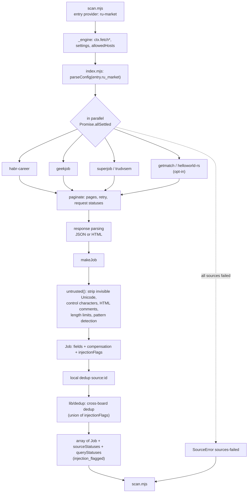
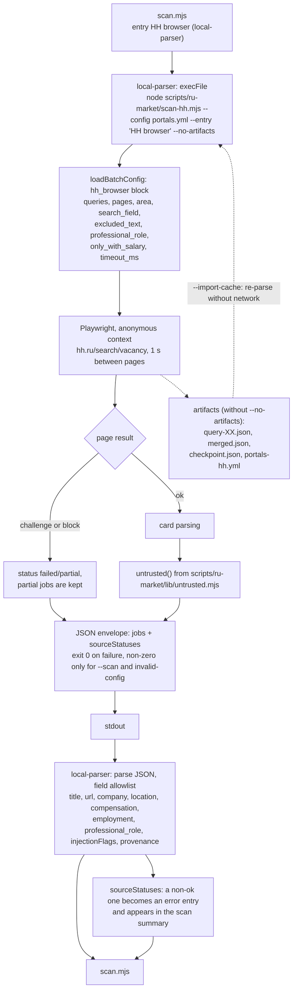
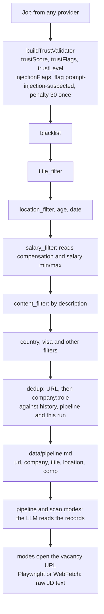

# Architecture: data flow

Status: Implemented
Date: 2026-10-10
Type: architecture

State as of version 0.7.0. Component relations: [components.md](components.md).

Vacancies reach core in two ways. Both end in the shared `scan.mjs` pipeline, where filters, the trust check and deduplication are applied. All external text passes through `untrusted.mjs` before it leaves the provider.

## Path 1: the ru-market provider (API and HTML)

## Path 2: HH through the companion and local-parser

## Shared scan.mjs pipeline

## Boundaries: what is protected where

| Stage | Protection | Residual risk |
|---|---|---|
| Provider output (`makeJob`, companion) | `untrusted()` on `title`, `company`, `location`, `note`, `description`. Flagged vacancies stay; the counter `injection_flagged` is in the statuses. | Patterns catch only obvious attacks. |
| Core trust check | `injectionFlags` becomes `prompt-injection-suspected` and a penalty of 30. Works only with a configured `trust_filter`. | With `trust_filter` off the field stays on the Job with no consequences. |
| `pipeline.md` | Format cleaning only (`sanitizeMarkdownField`). | Fields cleaned by the plugin still reach the LLM context. |
| Raw JD in core modes | Only an "untrusted" marker in the prompts. | The plugin does not close this path. It is closed by a separate upstream proposal (appendix in the roadmap). |

## Duplicates between paths

Path 1 and path 2 are different `portals.yml` entries, and core processes them in parallel (`CONCURRENCY = 10`). A duplicate is detected by URL, then by `company::role` with `company_aliases` taken into account, and the winner is the entry that finished first. To make HH data win for certain, run HH as a separate scan earlier (`--company "HH browser"`).
