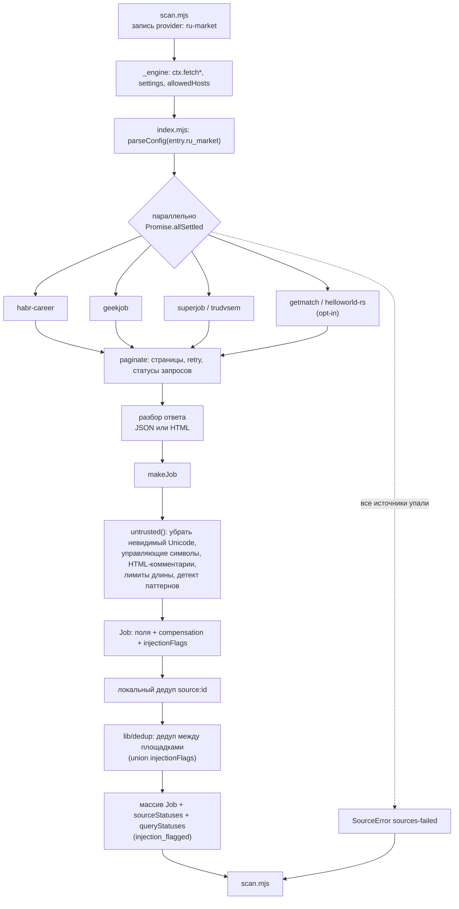
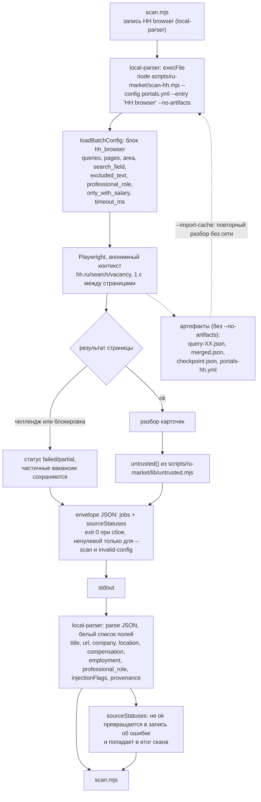
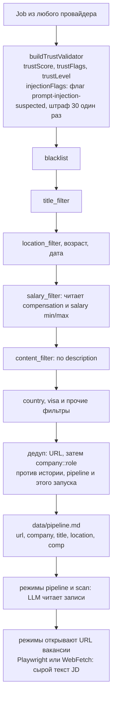

# Архитектура: поток данных

Состояние на версию 0.7.0. Связи компонентов: [components.md](components.md).

Вакансии попадают в core двумя путями. Оба заканчиваются в общем конвейере `scan.mjs`, где применяются фильтры, проверка доверия и дедуп. Весь внешний текст проходит через `untrusted.mjs` до того, как покинет провайдер.

## Путь 1: провайдер ru-market (API и HTML)

## Путь 2: HH через companion и local-parser

## Общий конвейер scan.mjs

## Что где защищено

| Этап | Защита | Остаточный риск |
|---|---|---|
| Выход провайдера (`makeJob`, companion) | `untrusted()` на `title`, `company`, `location`, `note`, `description`. Помеченные вакансии остаются, счётчик `injection_flagged` в статусах. | Паттерны ловят только очевидные атаки. |
| Проверка доверия core | `injectionFlags` превращается в `prompt-injection-suspected` и штраф 30. Работает только при настроенном `trust_filter`. | При выключенном `trust_filter` поле остаётся на Job без последствий. |
| `pipeline.md` | Только форматная очистка (`sanitizeMarkdownField`). | Очищенные плагином поля всё равно попадают в контекст LLM. |
| Сырой JD в режимах core | Только маркер «untrusted» в промптах. | Плагин этот путь не закрывает. Закрывается отдельным upstream-предложением (приложение в roadmap). |

## Дубликаты между путями

Путь 1 и путь 2 это разные записи `portals.yml`, core обрабатывает их параллельно (`CONCURRENCY = 10`). Дубликат определяется по URL, затем по `company::role` с учётом `company_aliases`, победителем остаётся запись, завершившаяся первой. Чтобы данные HH побеждали гарантированно, запускайте HH отдельным сканированием раньше (`--company "HH browser"`).
